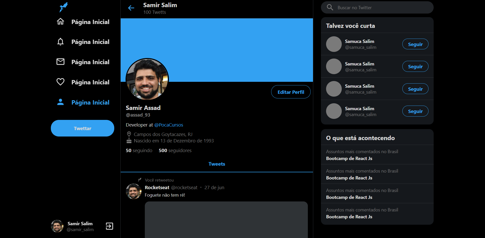

# Twitter Clone



> Twitter Clone é uma cópia da interface do twitter feita de forma responsiva.

## 🚀 Instalando Twitter Clone

Clone o projeto, abra o terminal na raiz do projeto e digite:

```
npm install
```

## ☕ Usando Twitter Clone

Para usar Twitter Clone, siga estas etapas:

Na raiz do projeto, execute no terminal:

```
npm run start
```

Fique à vontade para contribuir!
